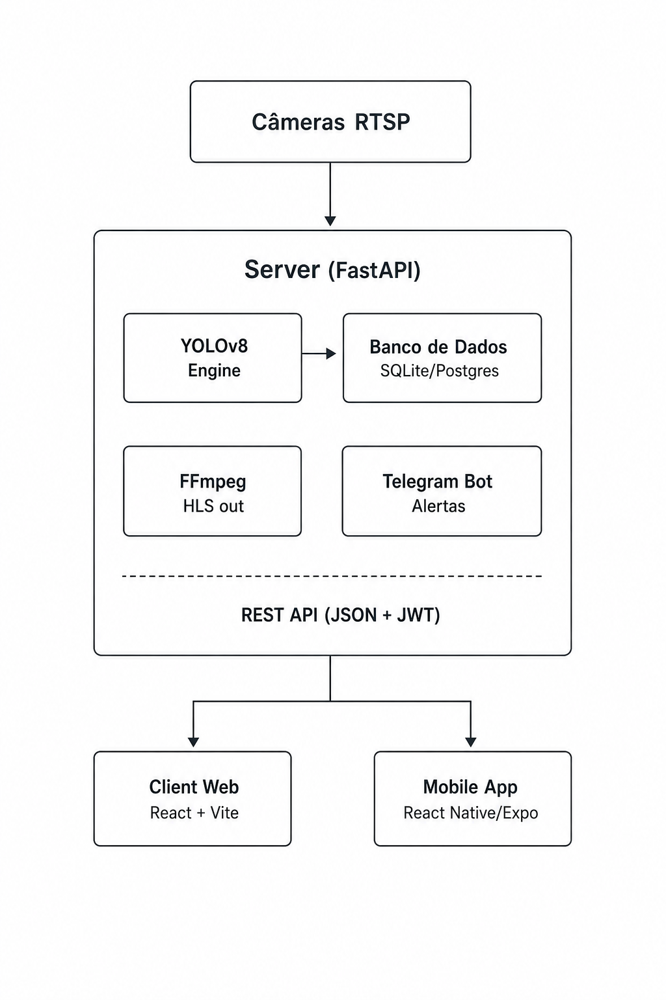

# Arquitetura do Sistema — EPIsee

## Visão Geral

O EPIsee segue uma arquitetura de três camadas desacopladas, onde cada parte pode ser desenvolvida, testada e deployada de forma independente. A comunicação entre as camadas acontece exclusivamente via API REST com autenticação JWT.

```
Câmeras RTSP
     │
     ▼
┌─────────────────────────────────────┐
│  Server (FastAPI)                   │
│                                     │
│  ┌──────────┐   ┌─────────────────┐ │
│  │  YOLOv8  │──▶│ Banco de Dados  │ │
│  │ Engine   │   │ SQLite/Postgres  │ │
│  └──────────┘   └─────────────────┘ │
│                                     │
│  ┌──────────┐   ┌─────────────────┐ │
│  │  FFmpeg  │   │  Telegram Bot   │ │
│  │ HLS out  │   │    Alertas      │ │
│  └──────────┘   └─────────────────┘ │
└────────────────┬────────────────────┘
                 │ REST API (JSON + JWT)
        ┌────────┴────────┐
        ▼                 ▼
┌──────────────┐  ┌───────────────────┐
│ Client Web   │  │ Mobile App        │
│ React + Vite │  │ React Native/Expo │
└──────────────┘  └───────────────────┘
```

---

## Componentes

### 1. Detection Engine (`detection_service_real.py`)

É o núcleo de processamento do sistema. Funciona como um loop assíncrono por câmera:

```
Camera RTSP URL
      │
      ▼
OpenCV VideoCapture
      │
      ▼ (a cada YOLO_INTERVALO = 0.3s)
YOLOv8 Inference (best.pt)
      │
      ├──▶ Classificar EPIs detectados
      │         ├── EPIs faciais (capacete, óculos, máscara...)
      │         ├── EPIs de torso (colete)
      │         └── EPIs sem interseção (luvas, macacão...)
      │
      ├──▶ Comparar com EPIs obrigatórios do setor
      │
      ├──▶ Se não-conforme:
      │         ├── Salvar frame (imagem da ocorrência)
      │         ├── Persistir Occurrence no banco
      │         └── Disparar alerta Telegram
      │
      └──▶ FFmpeg: converter frame → HLS stream
```

**Lógica de conformidade por setor:**
Os EPIs obrigatórios são definidos por setor na tabela `sectors.epis_obrigatorios` (JSON) ou no fallback estático `sector_epi_config.py`. A detecção compara os EPIs encontrados na cena com o conjunto obrigatório do setor da câmera.

**Lógica de sobreposição (IoU):**
- `helmet` sobre `head`: IoU mínimo de 0.25 para confirmar uso
- `safety-vest` sobre `person`: IoU mínimo de 0.15

### 2. API Layer (`app/api/`)

Cada arquivo corresponde a um domínio funcional, registrado como `APIRouter` no `main.py`:

| Módulo | Prefixo | Responsabilidade |
|---|---|---|
| `auth.py` | `/api/auth` | Login, geração e validação de tokens JWT |
| `users.py` | `/api/users` | CRUD de usuários, perfis, roles |
| `sectors.py` | `/api/sectors` | CRUD de setores e seus EPIs obrigatórios |
| `cameras.py` | `/api/cameras` | CRUD de câmeras IP |
| `detection.py` | `/api/detection` | Controle do engine (start/stop por câmera) |
| `occurrences.py` | `/api/occurrences` | Histórico de eventos, filtros |
| `epi_requests.py` | `/api/epi-requests` | Fluxo de solicitação e aprovação de EPIs |
| `dashboard.py` | `/api/dashboard` | KPIs, métricas de conformidade |
| `reports.py` | `/api/reports` | Dados para exportação de relatórios |
| `chatbot.py` | `/api/chatbot` | Integração com IA (OpenAI/DeepSeek) |
| `notifications.py` | `/api/notifications` | Notificações internas |
| `telegram.py` | `/api/telegram` | Webhook e comandos do bot Telegram |
| `training_videos.py` | `/api/training` | Biblioteca de vídeos de treinamento por EPI |

### 3. Database Layer

**ORM:** SQLAlchemy 2.0 com suporte assíncrono (`asyncio`).  
**Migrations:** Alembic — versionamento completo do schema.  
**Ambientes:**
- Desenvolvimento: SQLite (`aiosqlite`)
- Produção: PostgreSQL (`asyncpg`)

A mudança entre os dois é feita apenas pela variável `DATABASE_URL` no `.env`, sem alterar código.

### 4. Frontend React (`Client/`)

Aplicação SPA com React 18 + Vite:

```
App.jsx (React Router)
├── /login            → Login.jsx
├── /dashboard        → Dashboard.jsx (KPIs, gráficos Recharts)
├── /cameras          → Cameras.jsx (player HLS via hls.js)
├── /occurrences      → Occurrences.jsx (tabela + filtros)
├── /epi-requests     → EpiRequests.jsx (aprovação de solicitações)
├── /sectors          → Sectors.jsx (config de setores)
├── /users            → Usuarios.jsx
├── /reports          → Reports.jsx (exportação PDF)
├── /training         → TrainingVideos.jsx
└── /settings         → Settings.jsx (config YOLO, câmeras)
```

**AuthContext** gerencia o token JWT em localStorage e injeta o header `Authorization: Bearer <token>` em todas as requisições via Axios.

### 5. Mobile App (`Mobile/`)

Aplicação React Native com Expo SDK 54:

```
App.js
└── AppNavigator.js (React Navigation)
    ├── LoginScreen.js
    ├── HomeScreen.js (status do setor)
    ├── EpiRequestScreen.js (nova solicitação)
    ├── MyRequestsScreen.js (histórico)
    ├── ChatScreen.js (chatbot IA)
    ├── TrainingScreen.js (vídeos)
    ├── NR6Screen.js (norma NR-6)
    └── ProfileScreen.js
```

---

## Fluxo de Dados — Ocorrência

```
1. Camera stream (RTSP) → OpenCV captura frame
2. YOLOv8 infere → retorna bboxes + classes + confidence
3. Sistema compara EPIs detectados vs EPIs obrigatórios do setor
4. Se não-conforme:
   a. Salva imagem em disco
   b. Cria registro em occurrences (banco)
   c. alert_service.py → telegram_service.py → mensagem no Telegram
5. Frontend/Mobile consulta /api/occurrences periodicamente
6. Novo registro aparece no dashboard em tempo real
```

---

## Fluxo de Dados — Solicitação de EPI

```
1. Trabalhador (mobile/web) → POST /api/epi-requests/
2. Registro criado com status "pendente"
3. Notificação enviada ao gestor do setor
4. Gestor aprova/rejeita → PATCH /api/epi-requests/{id}
5. Status atualizado (aprovada / rejeitada)
6. Trabalhador vê atualização no app
```

---

## Autenticação e Autorização

O sistema usa dois roles:

| Role | Permissões |
|---|---|
| `gestor` | Acesso total: gestão de usuários, câmeras, setores, aprovação de EPIs, relatórios |
| `trabalhador` | Acesso limitado: visualizar próprio setor, solicitar EPIs, usar chatbot e treinamentos |

Além disso, existe o flag `is_system_admin` para operações administrativas globais.

**Fluxo JWT:**
1. `POST /api/auth/login` → server valida credenciais → retorna `access_token`
2. Cliente armazena token e envia no header: `Authorization: Bearer <token>`
3. Dependência `get_current_user` em cada rota valida e decodifica o token

---

## Modelo de Dados — Diagrama ER

```
users
├── id (PK)
├── name
├── email (unique)
├── hashed_password
├── role (gestor | trabalhador)
├── sector_id (FK → sectors)
├── phone
├── telegram_chat_id
└── is_system_admin

sectors
├── id (PK)
├── name (unique)
├── description
└── epis_obrigatorios (JSON)

cameras
├── id (PK)
├── name
├── location
├── sector_id (FK → sectors)
├── rtsp_url
└── is_active

occurrences
├── id (PK)
├── camera_id (FK → cameras, nullable)
├── sector_id (FK → sectors)
├── timestamp
├── status (conforme | nao_conforme)
├── epi_detected (JSON — lista de EPIs encontrados)
├── confidence
└── image_path

epi_requests
├── id (PK)
├── worker_id (FK → users)
├── manager_id (FK → users, nullable)
├── sector_id (FK → sectors)
├── epi_type
├── reason
├── status (pendente | aprovada | rejeitada)
├── entregue (boolean)
└── motivo_rejeicao

notifications
├── id (PK)
├── user_id (FK → users)
├── tipo
├── texto
└── lida

epi_types
├── id (PK)
├── nome
├── descricao
├── quando_usar
├── como_usar
├── erros_comuns
└── nr6_ref

training_videos
├── id (PK)
├── epi_type_id (FK → epi_types)
├── titulo
├── url
├── descricao
├── fonte
└── aprovado
```
